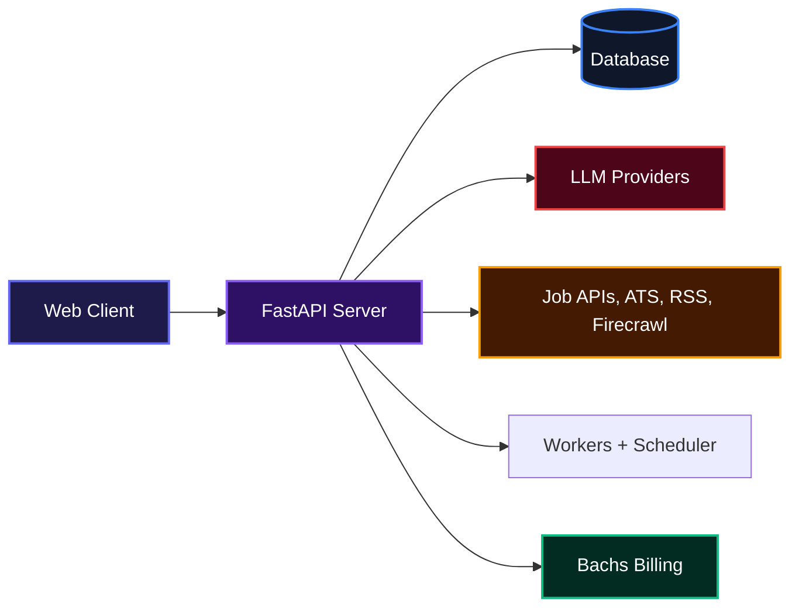
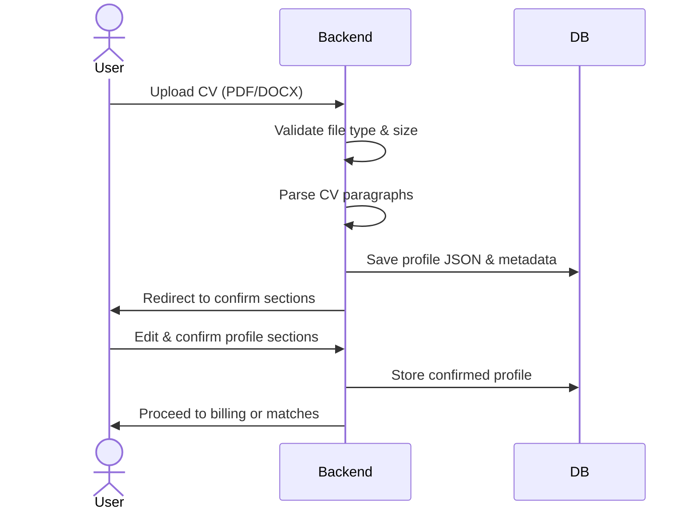
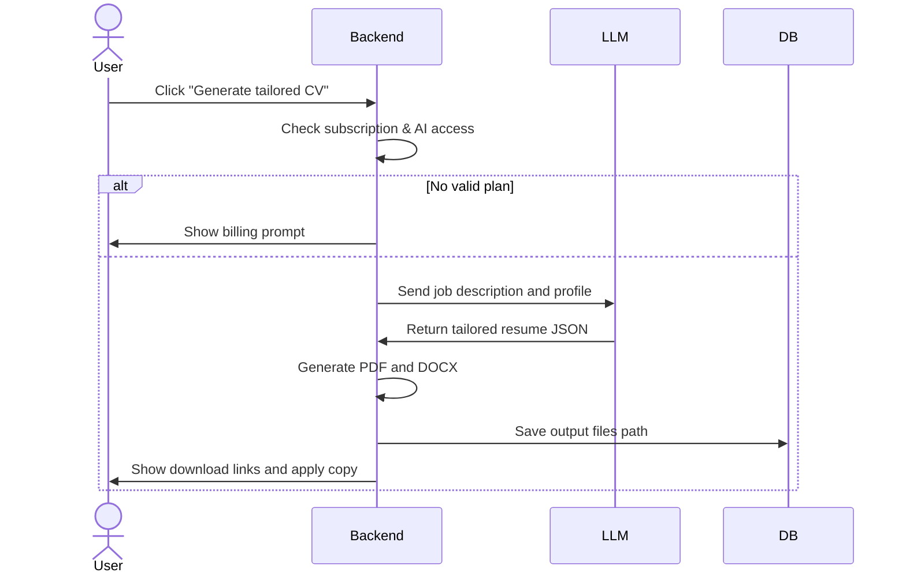
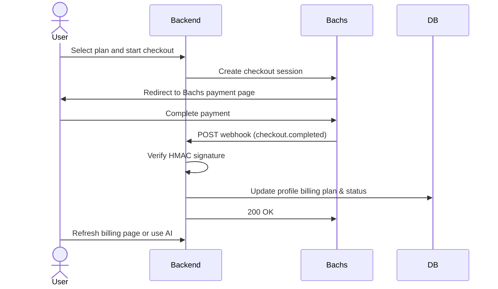

# Vitae

Vitae matches your CV against live job listings, scores how well each role fits your profile, and gives you a tailored resume and cover note for every application. It puts your career data to work, so you see the roles that actually match your skills and skip the noise.

## System Architecture




## Production architecture

Production runs the application as separate services from one immutable image:

- **Web:** FastAPI HTTP traffic only.
- **Workers:** durable background jobs. Catalogue and matching queues can scale independently.
- **Scheduler:** periodic job enqueueing only. It is not started by web replicas.
- **Database:** PostgreSQL is recommended for production.
- **Job discovery:** structured APIs, ATS boards, RSS sources, and optional Firecrawl open-web discovery.
- **Migrations:** run explicitly with `alembic upgrade head` before deploying application services.
- **Rate limiting:** local mode works for one process; set `RATE_LIMIT_BACKEND=redis` with `REDIS_URL` to share limits across web replicas.
- **Artifact storage:** generated CVs use the storage abstraction; production should use S3-compatible object storage.
- **Backups:** PostgreSQL backup and archive verification commands are provided under `scripts/`.

See [Phase 16 production architecture](docs/phase-16-production-architecture.md), [Phase 17 final cleanup](docs/phase-17-final-cleanup.md), and [Phase 22 data durability](docs/phase-22-data-durability.md) and [Phase 23 operational resilience](docs/phase-23-operational-resilience.md) and [Phase 24 security and access control](docs/phase-24-security-access-control.md).

## Installation

Requires [uv](https://docs.astral.sh/uv/) and Python 3.12.

```bash
git clone https://github.com/OktopalsHub/Vitae.git
cd Vitae
uv sync
cp .env.example .env
# edit .env with your own SECRET_KEY, FERNET_SECRET_KEY, and optionally API keys
uv run python run.py
```

Open http://127.0.0.1:8765. For production (FastAPI Cloud), set `APP_ENV=production`, `DATABASE_URL` to a Postgres connection string, and configure all required secrets. The app refuses to start with the default insecure keys outside of dev.

## Usage

After launching the app, the workflow looks like this:

1. **Register or sign in** via email, Google, or GitHub.
2. **Upload your CV** (PDF or DOCX) during onboarding. The app parses your skills, experience, and education automatically.
3. **Review and confirm** each extracted section. You can edit any field before confirming.
4. **Browse your matches** on the Jobs board. Every listing is scored against your profile, with a clear breakdown of why you’re a fit.
5. **Open any match** to access the Apply Assist workspace. From there you can:
   - Generate a tailored CV (PDF and DOCX) that highlights the skills the job description asks for.
   - Get a cover note and pre-written answers to common application questions.
   - Copy contact chips, rewrite individual answers with AI, and track your application status.
6. **Manage billing** to unlock every matched role and AI features. The first few openings are free; subscribe when you’re ready.

Admin users can sync the shared job catalogue from the Admin dashboard, and super admins can promote other users to admin roles.

## Features

### Automatic CV parsing and smart profile extraction
Upload once and Vitae builds a structured profile from your CV, including skills, work history, and education. You stay in control because every section can be reviewed and corrected before confirmation.



### AI-driven resume tailoring and application answers
When you open a job match, Vitae uses large language models (OpenAI, Gemini, Anthropic, or your own BYOK key) to rewrite your resume for that specific role. It also generates a personalized cover note and form answers based on your profile and the job description. Everything stays truthful because the AI only uses facts from your CV.



### Subscription billing with Bachs
Billing is handled through Bachs. Choose a monthly plan (BYOK or Platform AI) and pay via card. Webhooks update your subscription status automatically, and the app gates AI features and full job access behind an active subscription. Admins bypass billing entirely.



### Multi-source job catalogue
Vitae aggregates public job listings from Adzuna, Greenhouse, Lever, Wellfound, Djinni, and more. The catalogue syncs every hour, and scores refresh automatically every few hours. You can also paste a private job listing if you find something off-platform.

### Admin dashboard and catalogue sync
Admins can trigger a manual sync, view key metrics, and manage user roles. Super admins have full control over who can access admin features.

### Multiple career profiles
Each profile (e.g., Backend Engineer, DevOps) has its own CV, match scores, subscription, and AI keys. Switch between them anytime, and billing follows each profile independently.

## Production handoff

Before production, configure secrets, PostgreSQL, backups, durable object storage for generated artifacts, and separate web/worker/scheduler services. Verify `/health/ready` after migrations. The repository CI is the source of truth for tests and the production image build.

## Technologies Used

| Technology | Description |
|------------|-------------|
| [Python](https://www.python.org/) 3.12 | Core language |
| [FastAPI](https://fastapi.tiangolo.com/) | Web framework |
| [Jinja2](https://jinja.palletsprojects.com/) | Server-side HTML templating |
| [SQLAlchemy](https://www.sqlalchemy.org/) | ORM (supports SQLite and PostgreSQL) |
| [Pydantic](https://docs.pydantic.dev/) | Data validation and settings |
| [uv](https://docs.astral.sh/uv/) | Package and project management |
| [OpenAI / Anthropic / Google GenAI](https://platform.openai.com/) | Large language models for resume tailoring |
| [python-docx / fpdf2 / pypdf](https://github.com/python-openxml/python-docx) | CV parsing and PDF/DOCX generation |
| [FastAPI-Users](https://fastapi-users.github.io/fastapi-users/) | Authentication and user management |
| [Bachs](https://docs.bachs.io/) | Subscription billing and payment processing |
| [BeautifulSoup / lxml](https://www.crummy.com/software/BeautifulSoup/) | Web scraping for job boards |
| [pytest](https://docs.pytest.org/) | Testing framework |

[](https://www.python.org/)
[](https://fastapi.tiangolo.com/)
[](https://www.postgresql.org/)
[](https://docs.astral.sh/uv/)
[](https://platform.openai.com/)
[]()
